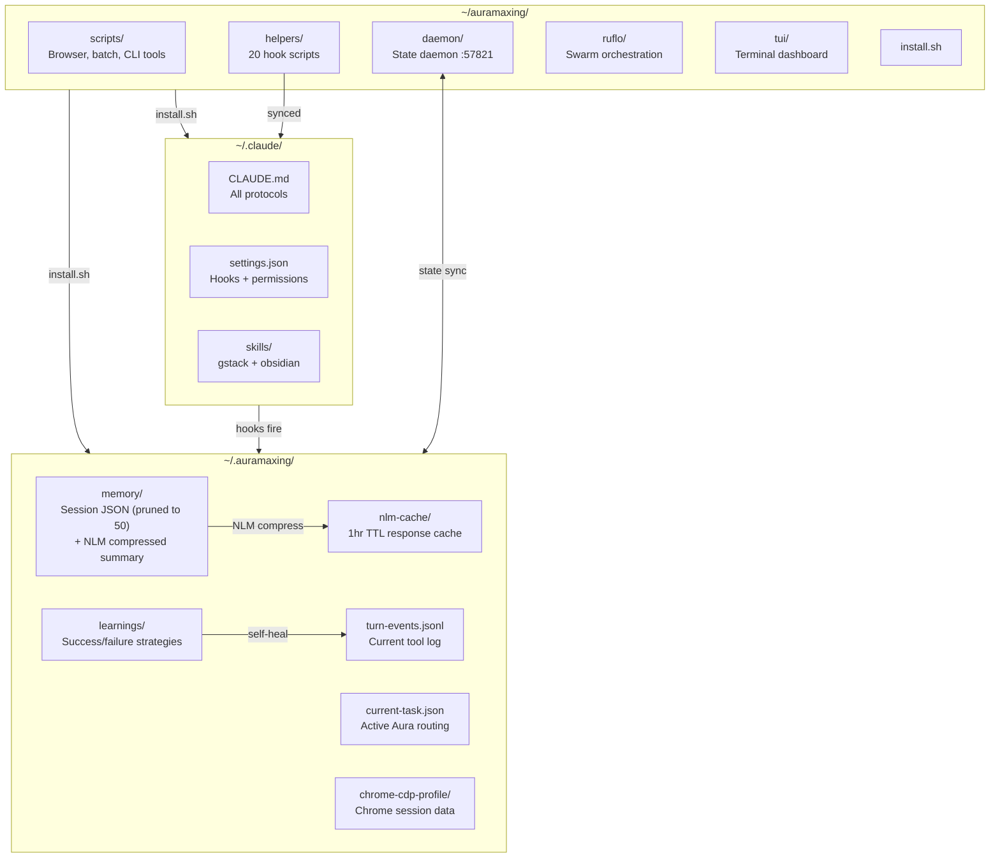

# Auramaxing

**The AI Development Operating System.**

Auramaxing turns Claude Code into something it was never designed to be: an autonomous, memory-rich, self-healing execution environment. Every prompt gets classified, enriched with past context, and routed through safety gates before a single tool fires. Memory persists across sessions. Secrets never hit disk. Failed tools retry with learned strategies. You type a prompt. Aura handles the rest.

```
v1.0.0  |  MIT License  |  Built on Claude Code
```

---

## What it does

- **Autopilot routing** -- the Aura engine fires on every prompt, classifies it against 25 task types, scores complexity, and emits execution directives
- **Prompt enrichment** -- injects memory, anti-laziness directives, and production-quality defaults the user never asked for
- **Self-healing** -- detects tool-specific failures and retries with learned strategies (3 attempts, logs winners for next time)
- **PII protection** -- blocks API keys, tokens, wallet addresses, and credentials before any Write, Edit, or Bash executes
- **Code quality gates** -- rejects hardcoded secrets on write, warns on `any` types and empty catch blocks
- **Persistent memory** -- decisions, patterns, and failures accumulate across sessions via structured JSON + NLM compression
- **LightRAG semantic search** -- sentence-transformers (all-MiniLM-L6-v2, 384-dim) index your project history for instant recall
- **NotebookLM compression** -- session context compressed to ~100 tokens via NLM, achieving 87% token reduction
- **Chrome CDP browser automation** -- reuses your real Chrome session (cookies, logins, everything) through DevTools Protocol
- **28 gstack skills** -- from `/investigate` to `/ship` to `/cso`, a full software factory in slash commands
- **11 MCP servers** -- context7, shadcn, supabase, github, sentry, figma, n8n, and more
- **Ruflo swarm orchestration** -- 60+ specialized agents coordinated through hierarchical-mesh topology
- **3-tier model routing** -- trivial tasks skip the LLM entirely, simple tasks route to Haiku, complex tasks get Opus

---

## Lifecycle

Every Claude Code session follows this state machine. No exceptions.

```mermaid
stateDiagram-v2
    [*] --> SessionStart

    state SessionStart {
        [*] --> UpdateCheck
        UpdateCheck --> LoadMemory: pass
        UpdateCheck --> BlockUpgrade: outdated
        BlockUpgrade --> LoadMemory: after upgrade
        LoadMemory --> LoadLearnings
        LoadLearnings --> WelcomePanel
        WelcomePanel --> InjectMemory
        InjectMemory --> StartRuflo
        StartRuflo --> [*]
    }

    SessionStart --> UserPrompt: user types

    state UserPrompt {
        [*] --> AuraEngine

        state AuraEngine {
            [*] --> Classify
            Classify --> ScoreComplexity
            ScoreComplexity --> Trivial: < 3%
            ScoreComplexity --> Medium: 3 - 49%
            ScoreComplexity --> Complex: >= 50%

            Trivial --> Silent: no enrichment
            Medium --> Route: skill + model + ENRICH
            Complex --> FullPipeline: EXECUTE + SPAWN + THINK
        }

        state PromptEngine {
            [*] --> MemorySearch
            MemorySearch --> NLMRecall
            NLMRecall --> AntiLaziness
            AntiLaziness --> QualityGate
            QualityGate --> EmitDirectives
        }

        AuraEngine --> PromptEngine
        PromptEngine --> [*]
    }

    UserPrompt --> ToolExecution: Claude processes directives

    state ToolExecution {
        [*] --> PreToolUse

        state PreToolUse {
            [*] --> PIIRedactor
            PIIRedactor --> Approve: clean
            PIIRedactor --> BLOCK: secret detected
            Approve --> CodeQualityGate
            CodeQualityGate --> Pass: no issues
            CodeQualityGate --> Warn: debug/any/empty catch
            CodeQualityGate --> BLOCK_2: hardcoded credential
        }

        PreToolUse --> ToolRuns: approved
        ToolRuns --> PostToolUse

        state PostToolUse {
            [*] --> LogEvent
            LogEvent --> FailureDetection
            FailureDetection --> SelfHeal: failure detected
            FailureDetection --> Continue: success
            SelfHeal --> RetryStrategy
            RetryStrategy --> Continue
        }

        PostToolUse --> PreToolUse: next tool call
        PostToolUse --> [*]: no more tools
    }

    ToolExecution --> Stop: Claude responds

    state Stop {
        [*] --> TaskComplete
        TaskComplete --> RenderDone: cost + summary
        RenderDone --> SessionStop

        state SessionStop {
            [*] --> SaveMemory
            SaveMemory --> SaveDecisions
            SaveDecisions --> NLMCompress: background
            NLMCompress --> PruneMemory: keep 50
            PruneMemory --> [*]
        }

        SessionStop --> [*]
    }

    Stop --> UserPrompt: next prompt
    Stop --> [*]: session ends
```



---

## Quick start

Install in 30 seconds:

```bash
git clone https://github.com/Blockchainpreneur/AURAMAXING ~/auramaxing
bash ~/auramaxing/install.sh
```

Start it:

```bash
ax
```

That's it. Aura fires on every prompt automatically. No configuration required.

### What the installer does

1. Copies hooks to `~/.claude/helpers/`
2. Writes `settings.json` with all hook bindings and bypass permissions
3. Sets up MCP server connections
4. Installs CLI dependencies (Bun, Playwright, LightRAG, NotebookLM CLI)
5. Creates `~/.auramaxing/` runtime directory
6. Registers the `ax` alias

---

## Architecture

### Data flow



### Directory structure

```
~/.auramaxing/
├── memory/                     Session memory (JSON, pruned to 50)
│   ├── 2026-04-10-*.json       Raw session entries
│   └── _compressed-summary.json NLM-compressed briefing (~100 tokens)
├── learnings/                  Self-healing strategy log
│   ├── *-success.json          Winning strategies (reused first)
│   └── *-failure.json          Error patterns (avoided)
├── nlm-cache/                  NotebookLM response cache (1hr TTL)
├── nlm-notebook-id             Active NLM notebook pointer
├── turn-events.jsonl           Tool events for current turn
├── current-task.json           Aura's active routing decision
├── last-update-check           Version check cache
└── chrome-cdp-profile/         Chrome DevTools Protocol session

~/auramaxing/
├── helpers/                    20 hook scripts (source of truth)
├── daemon/                     State daemon (port 57821)
├── scripts/                    Browser, batch, update, CLI tools
├── ruflo/                      Swarm engine + agent definitions
├── tui/                        Terminal dashboard (Textual)
├── setup/                      Installer configs + templates
├── skills/                     Custom skill creator
├── chrome-extension/           Sidebar extension for CDP
├── install.sh                  One-command installer
└── VERSION                     1.0.0
```

---

## Hook execution order

Every Claude Code event fires hooks in this exact order. All hooks exit 0 unconditionally -- Claude never waits on them.

| # | Event | Hook | What it does |
|:-:|-------|------|-------------|
| 1 | `SessionStart` | `session-start.mjs` | Update check, load memory + learnings, welcome panel, inject `[AURAMAXING MEMORY]` |
| 2 | `SessionStart` | `session-start-daemon.mjs` | Inject NLM-synthesized project context from daemon |
| 3 | `SessionStart` | `ruflo` (daemon) | Start swarm engine (60+ specialized agents) |
| 4 | `UserPromptSubmit` | `rational-router-apex.mjs` | Aura engine: classify, score, route, enrich, emit directives |
| 5 | `PreToolUse` | `pii-redactor.mjs` | Block API keys, tokens, wallet addresses, credentials |
| 6 | `PreToolUse` | `code-quality-gate.mjs` | Block hardcoded secrets (BLOCK), warn on `any`/empty-catch (WARN) |
| 7 | `PostToolUse` | `post-tool-use-apex.mjs` | Log structured events to `turn-events.jsonl`, detect failures, suggest recovery |
| 8 | `Stop` | `task-complete.mjs` | Render Done diagram with cost, clear turn events, send to daemon |
| 9 | `Stop` | `session-stop.mjs` | Save memory + decisions, spawn NLM compress (background), prune to 50 entries |

---

## Tool priority chain

Auramaxing enforces a strict priority order. Heavier tools are only used when lighter ones cannot do the job.

| Priority | Type | When to use | Examples |
|:--------:|------|-------------|---------|
| **P1** | gstack skills | First choice for any dev task | `/investigate`, `/review`, `/qa`, `/ship`, `/cso`, `/browse` |
| **P2** | CLI tools | Direct execution, no server overhead | `codex`, `gws`, `firecrawl`, `npx playwright test`, `notebooklm`, `lightrag` |
| **P3** | Browser CDP | Page interaction in user's Chrome | `browser-server.mjs`, `browser-tab.mjs`, Playwright via `connectOverCDP` |
| **P4** | MCP servers | Only when no CLI/skill equivalent | context7, shadcn, supabase, sentry, sequential-thinking |

### Why this order matters

MCP servers carry token overhead (tool definitions injected every call), require server startup, and add latency. CLI tools execute in a single Bash call. gstack skills encode entire workflows in one slash command. Use the lightest tool that gets the job done.

---

## Components

### Helpers (20 scripts)

| Component | File | Purpose |
|-----------|------|---------|
| **Aura Router** | `rational-router-apex.mjs` | Core autopilot: classify prompt, score complexity, select model tier, emit directives |
| **Router (legacy)** | `rational-router.mjs` | Previous-generation router, kept for fallback |
| **Prompt Engine** | `prompt-engine.mjs` | Enrich prompts with memory, anti-laziness rules, and production defaults |
| **PII Redactor** | `pii-redactor.mjs` | Block secrets, API keys, tokens, wallet addresses before Write/Edit/Bash |
| **Code Quality Gate** | `code-quality-gate.mjs` | Reject hardcoded credentials, warn on type-safety violations |
| **Post Tool Use** | `post-tool-use-apex.mjs` | Log tool events, detect failures, trigger self-healing |
| **Self-Heal** | `self-heal.mjs` | 3-retry with learned strategies, log winners for future reuse |
| **Session Start** | `session-start.mjs` | Welcome panel, update check, load memory + learnings |
| **Session Start Daemon** | `session-start-daemon.mjs` | Inject NLM-compressed context from state daemon |
| **Session Stop** | `session-stop.mjs` | Save memory, spawn NLM compression, prune entries |
| **Task Complete** | `task-complete.mjs` | Render Done diagram, clear turn events, post to daemon |
| **Memory Enrich** | `memory-enrich.mjs` | Search memory + LightRAG for relevant past context |
| **Memory Learn** | `memory-learn.mjs` | Extract and store learnings from completed tasks |
| **NotebookLM Bridge** | `notebooklm-bridge.mjs` | Interface to NLM CLI for deep recall and compression |
| **NLM Auth Refresh** | `nlm-auth-refresh.mjs` | Auto-refresh NLM authentication via Chrome CDP |
| **NLM Session Setup** | `nlm-session-setup.mjs` | Per-project notebook creation and initialization |
| **LightRAG Bridge** | `lightrag-bridge.mjs` | Semantic search with sentence-transformers (384-dim dense embeddings) |
| **Intent Predictor** | `intent-predictor.mjs` | Predict what the user will need before they ask |
| **CLAUDE.md Segments** | `claudemd-segments.mjs` | Per-task-type CLAUDE.md segments (~500 tokens vs ~6,000 full) |
| **Precompute Pipeline** | `precompute-pipeline.mjs` | 10-step background pipeline on session end |

### Scripts (12 tools)

| Script | Purpose |
|--------|---------|
| `browser-server.mjs` | Launch Chrome with CDP on port 9222, sync profile from user's Chrome |
| `browser-tab.mjs` | Open URLs, screenshot, read page text, list tabs |
| `lightrag-cli.py` | LightRAG semantic search CLI |
| `apply-batch.mjs` | Batch file operations from structured input |
| `batch-apply.mjs` | Multi-file edit orchestrator |
| `statusline.sh` | Status bar: model, context%, weekly%, cost vs API |
| `update-check.sh` | Check for new Auramaxing versions |
| `update.sh` | Self-update from remote |
| `fix-claude.sh` | Repair Claude Code configuration |
| `ram-manager.sh` | Memory pressure relief for long sessions |
| `launch-tui.sh` | Start the terminal dashboard |
| `gh` | Bundled GitHub CLI |

### Infrastructure

| Component | Purpose |
|-----------|---------|
| **Daemon** | State daemon on port 57821 -- persists session data, serves memory to hooks |
| **Ruflo** | Swarm orchestration engine with 60+ agent types and hierarchical-mesh topology |
| **TUI** | Textual-based terminal dashboard for monitoring sessions and agent activity |
| **Chrome Extension** | Sidebar extension for CDP browser automation feedback |

---

## Configuration

Auramaxing configures itself during installation. All settings live in `~/.claude/settings.json`.

### Permissions

All tool permissions are pre-approved (autopilot mode):

```json
{
  "permissions": {
    "defaultMode": "bypassPermissions"
  }
}
```

Read, Write, Edit, Bash, Agent, Task, WebFetch, MCP tools -- all execute without prompts. The PII redactor hook is the safety net.

### Hook bindings

Hooks are registered as Claude Code hook events in `settings.json`. Each hook specifies:
- **Event** -- when it fires (`SessionStart`, `UserPromptSubmit`, `PreToolUse`, `PostToolUse`, `Stop`)
- **Command** -- the Node.js script to execute
- **Matcher** -- optional tool name filter (e.g., PII redactor only fires on `Write`, `Edit`, `Bash`)

### Memory limits

| Type | Limit | Pruning |
|------|-------|---------|
| Session entries | 50 | Oldest-first |
| Prompt memories | 30 | Oldest-first |
| Decision records | 10 | Oldest-first |
| LightRAG documents | 500 | Oldest-first with dedup |
| NLM cache | 1 hour TTL | Auto-expire |

### Model routing

| Complexity | Model | Latency | Use case |
|:----------:|-------|---------|----------|
| < 3% | Silent | <1ms | Greetings, trivial |
| 3 - 49% | Haiku | ~500ms | Simple edits, lookups |
| >= 50% | Opus | 2-5s | Architecture, security, complex reasoning |

---

## For developers

### Adding a new hook

1. Create a `.mjs` file in `~/auramaxing/helpers/`
2. Export nothing -- hooks communicate via stdout (to Claude) and stderr (to terminal)
3. Read `process.env.CLAUDE_EVENT` for the event type and `process.stdin` for event data
4. Register in `settings.json` under the appropriate event
5. Run `bash ~/auramaxing/install.sh` to sync

### Adding a new gstack skill

```bash
bash ~/auramaxing/skills/skill-creator/init_skill.sh my-skill
```

This creates the skill directory with YAML frontmatter, progressive disclosure structure, and hook registration.

### Browser automation

Connect to the user's Chrome via CDP:

```javascript
const { chromium } = require('playwright');
const browser = await chromium.connectOverCDP('http://localhost:9222');
const context = browser.contexts()[0];
const page = context.pages().find(p => p.url().includes('target'));
```

Rules: never open new windows (tabs only), never close tabs, always start `browser-server.mjs` first.

### Self-healing strategies

When a tool fails, Auramaxing:
1. Checks `~/.auramaxing/learnings/` for a known working strategy
2. If found, applies the winning strategy immediately
3. If not, tries up to 3 alternatives
4. Logs the winner to `*-success.json` for next time

To inspect learned strategies:

```bash
ls ~/.auramaxing/learnings/
cat ~/.auramaxing/learnings/*-success.json
```

### Precompute pipeline

The 10-step pipeline runs in the background on every session end:

1. Accumulate tool events
2. Synthesize session summary
3. Update NLM notebook
4. Rebuild LightRAG index
5. Deduplicate vectors (eliminated 48% duplicates)
6. Prune by type limits
7. Generate anti-laziness directives
8. Compress learnings (96% token reduction)
9. Build per-task CLAUDE.md segments (~500 tokens each)
10. Update cross-project knowledge graph

---

## Requirements

- macOS or Linux
- Node.js >= 18
- Claude Code CLI -- `npm install -g @anthropic-ai/claude-code`
- Bun -- `curl -fsSL https://bun.sh/install | bash`
- Python 3.10+ (for sentence-transformers / LightRAG)

---

## License

MIT
